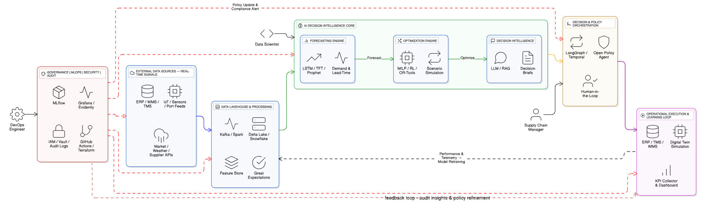

# 🧠 Enterprise AI Supply Chain Architecture 2026  
**From Forecasting to Autonomous Decision-Making** **Designed & Presented by [Ganesh Prasad Bhandari](https://www.linkedin.com/in/ganesh-prasad-bhandari-b165b9187/)**

---

## 🎓 Cite this Research & Authority
**Bhandari, G. P. (2026).** *Autonomous AI Supply Chain Orchestration: A Multi-Agent System Architecture.* 📘 **Technical Whitepaper (Zenodo/CERN):** [Link Coming Soon - Insert DOI Here]  
📊 **Reference Dataset (IEEE Dataport):** [Augmented Bone Tumor Segmentation & Triage Dataset](https://ieee-dataport.org/documents/btxrd-2024-augmented-bone-tumor-segmentation-and-triage-dataset-balanced-malignant-class)  
🚀 **Newsletter:** [Join AI Vanguard on LinkedIn](https://www.linkedin.com/newsletters/7220489256505331712/)

---

## 📘 Overview
This project presents a complete **Enterprise AI Supply Chain Architecture** — a real-world operational framework that transforms traditional supply chains into **intelligent, adaptive, and autonomous systems** using AI, MLOps, and governance.  

Unlike proofs-of-concept that often fail in deployment, this architecture is built for:  
✅ **End-to-end automation** | ✅ **Real-time decision-making** | ✅ **Scalable multi-cloud deployment** | ✅ **Continuous learning**

---

## ⚙️ Problem Statement
Modern global supply chains face:
- **Forecasting errors** leading to excess inventory or stockouts.  
- **Siloed systems** across procurement, logistics, and production.  
- **Manual decisions** that slow down operations and reduce agility.  
- **Lack of explainability** and governance in AI decision-making.

---

## 🏗️ System Architecture

> *Figure 1: High-level orchestration of the Autonomous Supply Chain, featuring Agentic Decision Intelligence and MLOps Governance.*

---

## 🚀 Solution: The "Decision Intelligence" Core
The **Enterprise AI Supply Chain Architecture** introduces:
- **AI Decision Intelligence Core** — A hybrid of predictive and prescriptive AI that continuously forecasts, optimizes, and acts.  
- **MLOps + Governance Stack** — Ensures continuous deployment, monitoring, and ethical AI operations.  
- **Human-in-the-loop Feedback Loop** — Balances high-velocity automation with human accountability.  

---

## 🔹 Layered Technical Deep-Dive
1. **Data Ingestion Layer**
   - Real-time data from IoT sensors, ERP systems (SAP/Oracle), CRM, and logistics APIs streamed via **Kafka / AWS Kinesis**.  
2. **AI Core (Decision Intelligence Engine)**
   - **Forecasting:** Demand prediction using LSTM / Transformer-based architectures.  
   - **Optimization:** Reinforcement learning + heuristics to minimize cost and delivery time.  
3. **MLOps & Governance Layer**
   - Continuous deployment pipelines using **MLflow or Kubeflow**.  
   - Bias detection, model drift monitoring, and explainable AI (XAI) dashboards.  
4. **Execution & Feedback Loop**
   - Closed-loop system: Real-world outcomes → Model retraining → Decision refinement.  

---

## 🧩 Key Features & Tech Stack

### **Key Capabilities**
| Category | Description |
|-----------|--------------|
| **Forecasting** | Predicts demand fluctuations using ML time-series models. |
| **Optimization** | Allocates logistics dynamically via RL and constraint solvers. |
| **Autonomous Decisioning** | Runs AI orchestration to manage supply chain flow end-to-end. |
| **Governance** | Implements explainability, audit, and bias control frameworks. |

### **Technology Stack**
| Layer | Technology / Tool |
|-------|-------------------|
| **Data & Storage** | AWS S3, Snowflake, Azure Data Lake, PostgreSQL |
| **AI / ML Core** | PyTorch, TensorFlow, HuggingFace Transformers |
| **MLOps** | MLflow, Kubeflow, Airflow, SageMaker Pipelines |
| **Deployment** | Docker, Kubernetes (K8s), Terraform, GitHub Actions |

---

## 🧠 Business Impact
| Metric | Target Improvement |
|---------|--------------|
| **Forecast Accuracy** | +24% |
| **Operational Efficiency** | +28% |
| **Decision Latency** | -35% |
| **Sustainability Score** | +18% |

---

## 🎥 YouTube Series: Architecture Walkthrough

- 🎬 [**Episode 1: AI Health Coach Architecture**](https://www.youtube.com/watch?v=xI3dF-FLsy8)  
- 🎬 [**Episode 2: AI Supply Chain Architecture (This Project)**](https://youtu.be/689c0CfjpQI)  

---

## 🧭 Author & Global Ecosystem
**Ganesh Prasad Bhandari** *AI Solution Architect | Enterprise AI & GenAI Innovator* 📍 Massachusetts, USA  

🌍 **Connect With Me:** [🔗 LinkedIn](https://www.linkedin.com/in/ganesh-prasad-bhandari-b165b9187/) | [▶️ YouTube](https://www.youtube.com/@AIINOVATEHUB) | [🧠 Medium](https://medium.com/@ganeshprasadbhandari79) | [💻 GitHub](https://github.com/GaneshPrasadBhandari) | [🧬 ORCID](https://orcid.org/0009-0002-7308-4279)

---

## 🧾 References & Credits
- Visualized with **Eraser.io** | Outline collaboration via **NotebookLM**.  
- **License:** Creative Commons Attribution-NonCommercial 4.0 (CC BY-NC 4.0).

> “Architecture concept adapted and expanded for educational use by **Ganesh Prasad Bhandari (© 2026)**.”
